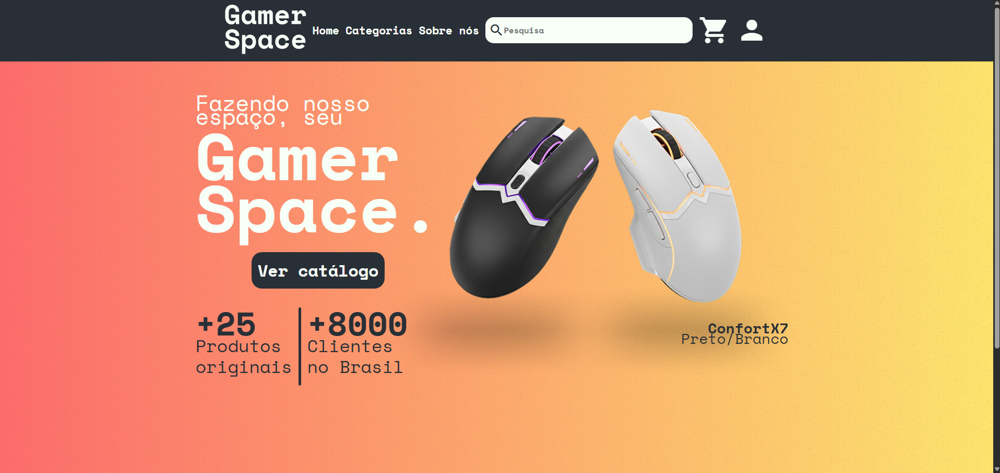
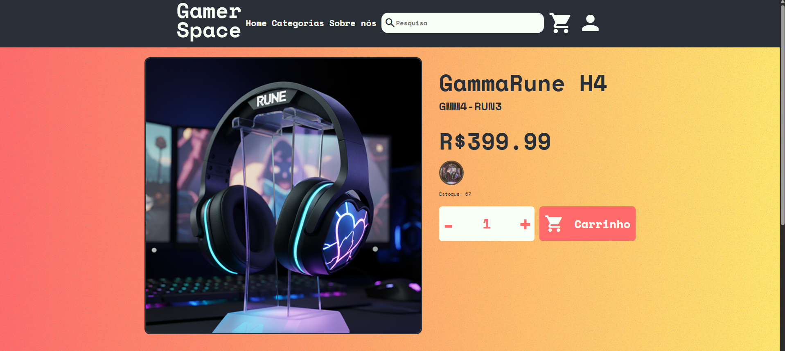
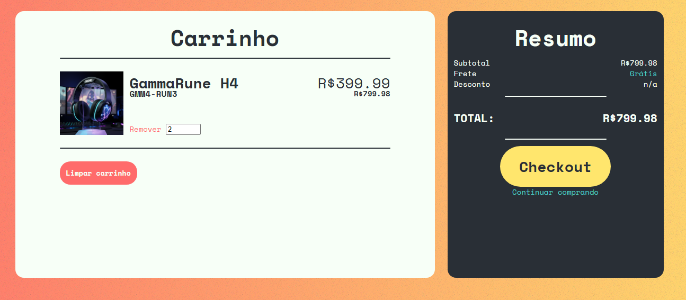
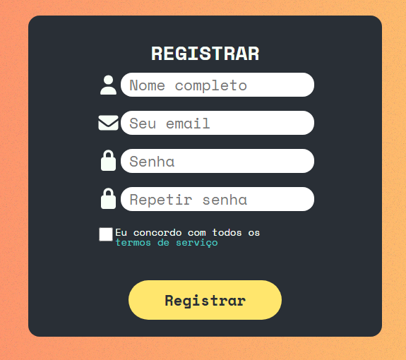

# GamerSpace

[](/LICENSE)
[](https://sonarcloud.io/summary/new_code?id=DerickPipoca_GamerSpace-Project)


---

## Conteúdo

- [Sobre o Projeto](#sobre-o-projeto)
- [Pré requisitos](#pré-requisitos)
- [Instalação e Execução](#instalação-e-execução)
- [Roadmap](#roadmap)
- [English summary](#english-summary)
- [Autor](#autor)

## Sobre o projeto

<p align="justify"> GamerSpace é um projeto fullstack de um e-commerce para periféricos 'Gamer'. Feito em camadas, clean architecture e DDD.
<br> 
Pensado para servir como projeto de portfólio, com boas práticas em .NET e Angular.
</p>

### Tecnologias usadas

- **Linguagem e Framework:**
  - Back-end/API:
    - [C#](https://learn.microsoft.com/pt-br/dotnet/csharp/)
    - [ASP.NET Core 9 (Web API)](https://dotnet.microsoft.com/pt-br/)
  - Front-end:
    - [Angular 20](https://angular.dev/)
    - [TypeScript](https://www.typescriptlang.org/)
    - [Sass](https://sass-lang.com/)
- **Banco de Dados:**
  - [MySQL](https://www.mysql.com/)
  - [Entity Framework Core 9](https://learn.microsoft.com/pt-br/ef/core/) - NuGet [Pomelo](https://github.com/PomeloFoundation/Pomelo.EntityFrameworkCore.MySql)
- **Bibliotecas e Ferramentas:**
  - [JWT (JSON Web Tokens)](https://jwt.io/) - Autenticação
  - [AutoMapper](https://automapper.org/) - Mapeamento de Objetos
  - [FluentValidation](https://fluentvalidation.net/) - Validação
  - [Swagger](https://swagger.io/) - Documentação da API

### Imagens

<details>
<summary>Landing Page</summary>

</details>
<details>
<summary>Página de produto</summary>

</details>
<details>
<summary>Carrinho</summary>

</details>
<details>
<summary>Login</summary>

</details>
<details>
<summary>Register</summary>

</details>

## Arquitetura

### Backend (.NET)

Solução `GamerSpace.sln` organizada em camadas:

- **GamerSpace.API**  
  API HTTP (ASP.NET Core) que expõe endpoints para:
  - produtos e variantes
  - categorias e tipos de classificação
  - autenticação (registro/login)
  - pedidos/checkout

- **GamerSpace.Application**  
  Casos de uso e lógica de aplicação (commands/queries, DTOs).

- **GamerSpace.Domain**  
  Modelo de domínio (entidades, regras de negócio).

- **GamerSpace.Infrastructure**  
  Acesso a dados e integrações externas (repositórios, contexto de banco, etc.).

### Frontend (Angular)

Aplicação Angular na pasta `GamerSpace.UI`, estruturada em:

- **core**: serviços centrais, guards, configuração.
- **features**: módulos de funcionalidade (produtos, carrinho, auth, admin, etc.).
- **layout/shared**: componentes reutilizáveis e layout (como o `product-card`).

Rotas principais (exemplos):

- `/home` – página inicial.
- `/products` – listagem de produtos.
- `/cart` – carrinho.
- `/login` e `/register` – autenticação.
- `/admin/...` – área administrativa.

## Pré requisitos

Antes de começar, garanta que você tem instalado o Docker:

- [Docker Desktop](https://docs.docker.com/desktop)

## Instalação e Execução

Siga os passos abaixo para ter um multi-container do docker rodando localmente em sua máquina:

### Via CLI (Development)

1. Clone o repositório.
2. Algumas informações sensíveis devem ser configuradas via User Secrets. No terminal, na pasta do projeto, execute os comandos abaixo para configura-las:

```bash
# Iniciar user-secrets
cd Backend/GamerSpace.API
dotnet user-secrets init

# Configurar a Connection String
dotnet user-secrets set "ConnectionStrings:Default" "Server=localhost;Database=GamerSpaceDB;Uid=root;Pwd=SUA_SENHA"

# Configurar a Key do JWT
dotnet user-secrets set "Jwt:Key" "SUA_CHAVE_LONGA_AQUI"

# Opcional: Issuer/Audience
dotnet user-secrets set "Jwt:Issuer" "GamerSpace.API"
dotnet user-secrets set "Jwt:Audience" "GamerSpace.Frontend"
```

3. Rode a API e o frontend (verifique a URL/porta no output do terminal):
   - Swagger normalmente fica em `/swagger`
   - Frontend normalmente em `http://localhost:4200`

### Via Docker (Production)

1. Clone o repositório.
2. Crie um arquivo `.env` na raiz do projeto e siga o modelo do arquivo `.env.example`
3. Na raiz do projeto, execute:
   ```bash
   docker-compose up --build
   ```
4. Acesse o projeto em http://localhost:4200.

## Roadmap

O projeto ainda não está 100% completo, mas o MVP está feito.

- [ ] Pagamento integrado com PagSeguro.
- [ ] Histórico de pedidos específico de cada usuário.
- [ ] Histórico de pedidos geral (ADMIN).
- [ ] Gerenciamento dos tipos de categorias (ADMIN).
- [ ] Alterar senha.
- [ ] Descrição dos itens em MD.

## English summary

A project for my portfolio named GamerSpace. It's a full stack application for an gaming gear e-commerce, built with **ASP.NET Core** and **Angular**.  
It showcases:

- A layered backend architecture `(API, Application, Domain, Infrastructure)`
- A feature-based Angular frontend `(products, cart, auth, admin)`
- Typical e‑commerce flows: product catalog, authentication, cart and checkout and admin product management.

## Autor

[@DerickPipoca](https://github.com/DerickPipoca)<a name = "autor"></a>
